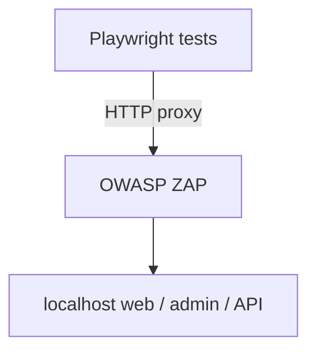

# DBA V2 Test Suite Documentation

This document describes the comprehensive test suite for the Designed By Anthony V2 architecture, including Playwright E2E tests and OWASP API security tests.

## 🚀 Quick Start

### Install Dependencies

```bash
bun install
bun run test:install  # Install Playwright browsers
```

### Run Tests

```bash
# Run all tests
bun run test

# Run only E2E tests
bun run test:e2e

# Run only security tests
bun run test:security

# View test report
bun run test:ui
```

### Easy Run

`bun run test` is the default happy path. It now:

1. Applies the local D1 migrations before the suite starts.
2. Starts the API, web, and admin services through Playwright when needed.
3. Seeds the admin pipeline test with its own lead row, so the suite does not depend on prior test order.

If you already have the stack running manually, set `PLAYWRIGHT_SKIP_WEBSERVER=1` and run `bun run test` from the repo root.

## 📁 Test Structure

```
apps/
├── web/
│   └── tests/
│       └── e2e/
│           └── critical-paths.spec.ts  # E2E user journey tests
├── api/
│   └── tests/
│       └── security/
│           └── owasp.spec.ts           # API security tests
test/
├── setup.ts                            # Global test setup
├── teardown.ts                         # Global test cleanup
playwright.config.ts                    # Playwright configuration
```

## 🧪 Round 1: Playwright E2E User Journeys

### Test Cases

1. **pSEO Conversion** (`/infrastructure/utica/hvac`)
   - Verifies CSS Grid Hero renders without scrolling
   - Tests LighthouseAuditForm submission
   - Validates UI transitions to "Pending/Processing" state
   - Mocks Cloudflare Turnstile captcha

2. **Sovereign Lead Trap**
   - Tests SiteContactDrawer functionality
   - Validates URL field auto-prepends `https://`
   - Verifies SovereignLeadForm submission
   - Confirms success state and drawer closure

3. **Admin Pipeline**
   - Mocks Cloudflare Zero Trust authentication
   - Verifies admin dashboard loads
   - Tests "315 Pipeline" table data rendering
   - Confirms "No rows" error is resolved

### Test Configuration

- **Base URL**: `http://localhost:3000` (configurable via `NEXT_PUBLIC_WEB_URL`)
- **API URL**: `http://localhost:8787` (configurable via `NEXT_PUBLIC_API_URL`)
- **Turnstile Sitekey**: `1x00000000000000000000AA` (Cloudflare test key that always passes)
- **Viewport**: 1920×1080 (Desktop Chrome)

## 🔒 OWASP ZAP (optional passive proxy)

Playwright **does not** start ZAP automatically. By default traffic goes **directly** to localhost, so ZAP’s HUD stays empty unless you route tests through a proxy.

### Enabling the proxy

Set **`PLAYWRIGHT_ZAP_PROXY`** (for example `http://127.0.0.1:8080`), or run **`./scripts/run-playwright-with-zap.sh`** (same default). `playwright.config.ts` applies this to browser navigation **and** `request` / API tests so ZAP sees HTML + `/leads` traffic.

**Passive recording**: ZAP logs what Playwright hits; spider/active scans and HTML report export are **manual** (ZAP UI or ZAP API), unless you add automation separately.

### Diagram



### ZAP Docker example

```bash
docker run --rm -p 8080:8080 ghcr.io/zaproxy/zaproxy:stable zap.sh -daemon \
  -host 0.0.0.0 -port 8080 -config api.disablekey=true
```

## 🎛️ Configuration

### Environment Variables

Create a `.env.test` file for custom configuration:

```env
# Web application URL
NEXT_PUBLIC_WEB_URL=http://localhost:3000

# API endpoint URL
NEXT_PUBLIC_API_URL=http://localhost:8787

# Test database connection (if needed)
TEST_DATABASE_URL=file:./test.db
```

### Playwright Configuration

Edit `playwright.config.ts` to customize:

- **Timeouts**: Adjust `timeout` and `expect.timeout`
- **Retries**: Modify `retries` (2 in CI, 0 locally)
- **Browsers**: Add/remove browser configurations
- **Reporting**: Configure HTML, JSON, or other reporters

## 📊 Test Reporting

Tests generate comprehensive reports in `test-results/` directory:

- **HTML Report**: Interactive report with screenshots and traces
- **List Report**: Console output during test execution
- **Traces**: Detailed execution traces for failed tests

View reports with:

```bash
bun run test:ui
```

## 🔧 Mocking & Test Utilities

### Cloudflare Turnstile Mocking

The test suite automatically mocks Cloudflare Turnstile:

```typescript
// Mock siteverify endpoint
await page.route('**/api/siteverify', route => {
  route.fulfill({
    status: 200,
    body: JSON.stringify({ success: true })
  });
});

// Mock Turnstile widget
await page.route('**/turnstile.js', route => {
  route.fulfill({
    status: 200,
    body: `window.turnstile = { render: () => 'mock' }`
  });
});
```

### Cloudflare Zero Trust Mocking

Admin tests mock authentication:

```typescript
await context.addCookies([
  {
    name: 'CF_Authorization',
    value: 'mock-zero-trust-token',
    domain: 'localhost',
    path: '/',
    httpOnly: true,
    secure: true
  }
]);
```

### API Response Mocking

Mock API endpoints for controlled testing:

```typescript
await page.route('**/api/leads', route => {
  route.fulfill({
    status: 200,
    body: JSON.stringify({ leads: [...] })
  });
});
```

## 🚨 Troubleshooting

### Common Issues

**1. Playwright not installed**
```bash
bun run test:install
```

**2. Port conflicts**
- Ensure web app runs on port 3000
- Ensure API runs on port 8787
- Adjust `playwright.config.ts` if using different ports

**3. Test timeouts**
- Increase timeout in `playwright.config.ts`
- Check for slow API responses
- Verify database connections

**4. Fresh checkout or reset local D1**
- Just run `bun run test`
- The Playwright bootstrap applies the local migrations automatically before tests start

**4. Missing environment variables**
- Create `.env.test` file
- Set required variables before running tests

## 🎯 Best Practices

1. **Isolate Tests**: Each test should be independent
2. **Mock External Services**: Avoid real API calls in tests
3. **Use Test Data**: Never use production data
4. **Keep Tests Fast**: Aim for <30s per test
5. **Test Critical Paths**: Focus on user journeys
6. **Security First**: Test all OWASP Top 10 vulnerabilities

## 🔄 CI/CD Integration

Add to your CI pipeline:

```yaml
- name: Install dependencies
  run: bun install

- name: Install Playwright browsers
  run: bun run test:install

- name: Run E2E tests
  run: bun run test:e2e

- name: Run security tests
  run: bun run test:security

- name: Upload test results
  uses: actions/upload-artifact@v3
  if: always()
  with:
    name: test-results
    path: test-results/
```

## 🚀 Running Playwright through ZAP

```bash
chmod +x scripts/run-playwright-with-zap.sh   # one-time

# Terminal 1: ZAP (see Docker example above)
# Terminal 2:
./scripts/run-playwright-with-zap.sh

# Custom proxy URL:
PLAYWRIGHT_ZAP_PROXY=http://127.0.0.1:8090 ./scripts/run-playwright-with-zap.sh

# Staging targets (same proxy idea):
NEXT_PUBLIC_WEB_URL=https://staging.example.com \
NEXT_PUBLIC_API_URL=https://api.staging.example.com \
./scripts/run-playwright-with-zap.sh
```

HTML reports from Playwright itself live under **`test-results/`** (see `playwright.config.ts`). **ZAP** HTML/JSON/XML exports are produced from **ZAP’s UI or API** if you configure those steps yourself.

### Docker Requirements

Ensure Docker is installed and running:

```bash
# Install Docker (if not already installed)
brew install --cask docker

# Start Docker service
open -a Docker

# Verify Docker installation
docker --version
docker run hello-world
```

## 📋 Test Coverage

| Category | Tests | Coverage |
|----------|-------|----------|
| E2E journeys (`fortress.spec.ts`) | 3 | pSEO audit form, contact drawer normalization, admin ledger |
| Stack health (`health.spec.ts`) | 3 | Web root, API `/health`, admin shell |
| Marketing smoke (`marketing-smoke.spec.ts`) | varies | Batched GETs over full marketing path catalog + extra shells |
| API fuzzer (`fuzzer.spec.ts`) | 3 | Rate limit, SQLi-ish payload, XSS-ish payload on `/leads` |
| **Example total** | **12** | Run `bunx playwright test --list` for the exact count |

**ZAP** does not add Playwright tests; it only observes traffic when `PLAYWRIGHT_ZAP_PROXY` is set.

## 🎓 Learning Resources

- [Playwright Documentation](https://playwright.dev/docs/intro)
- [OWASP ZAP Documentation](https://www.zaproxy.org/docs/)
- [OWASP Testing Guide](https://owasp.org/www-project-web-security-testing-guide/)
- [Cloudflare Workers Testing](https://developers.cloudflare.com/workers/testing/)
- [Docker Security Scanning](https://docs.docker.com/engine/scan/)
